# Dog Cat Segmentation
> This work has been done thanks to the [U-Net: Convolutional Networks for Biomedical Image Segmentation](https://arxiv.org/abs/1505.04597) (Ronneberger et al. 2015)

### Requirements
 
- Python 3.8
- TensorFlow 2.2.0
- mathplotlib
- opencv
- numpy

The required libraries can also be installed with pip:
```bash
pip install -r requirements.txt
```
The dataset used for traning can be downloaded with:
```bash
./dataset.sh
```

### Training
To train the model run the following command:
```
python train.py --lr float --epochs int \
                --train_steps int --val_steps int \ 
                --checkpoint_dir path --weight_path path
```
where:
  - --lr: Learning rate. Default=0.001
  - --epochs: Number of training epochs. Default=20
  - --train_steps: Number of training steps per epoch. Default=100
  - --val_steps: Number of validation steps. Default=50
  - --checkpoint_dir: Path to write checkpoint. Default="./model/checkpoint"
  - --weight_path: path to save model weight. Default="./model/weights/unet.h5"

### Results
- Images from validation set:

Original Image | True Mask | Predicted Mask
:-------------:|:---------:|:--------------:
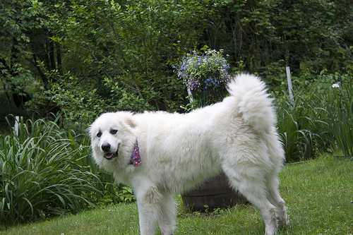 |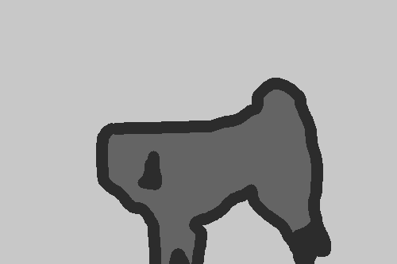 |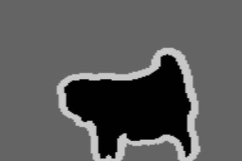
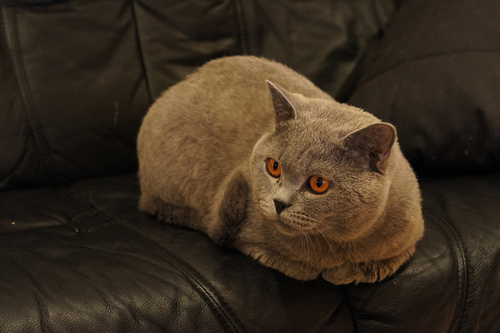 |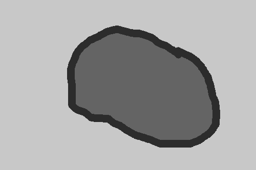 |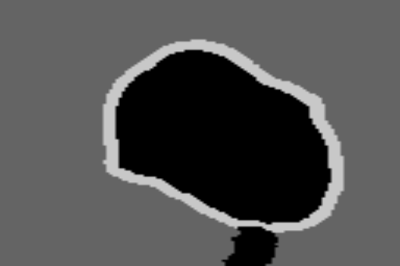
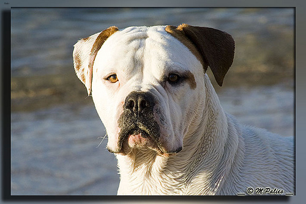 |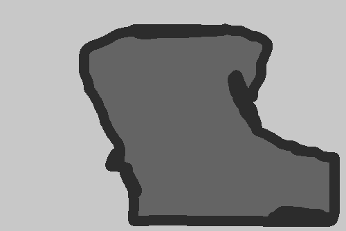 |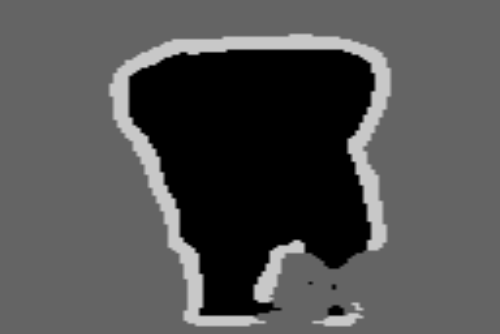
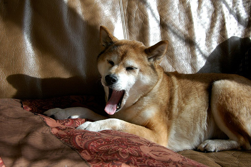 |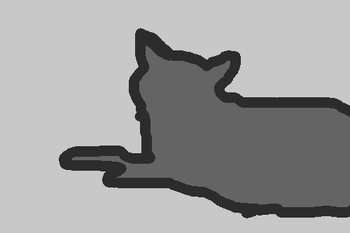 |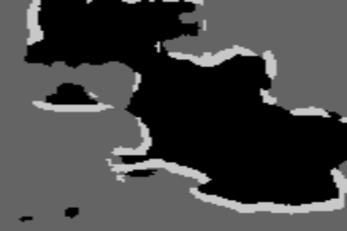 


- Random images from the internet:

Original Image | Predicted Mask
:-------------:|:--------------:
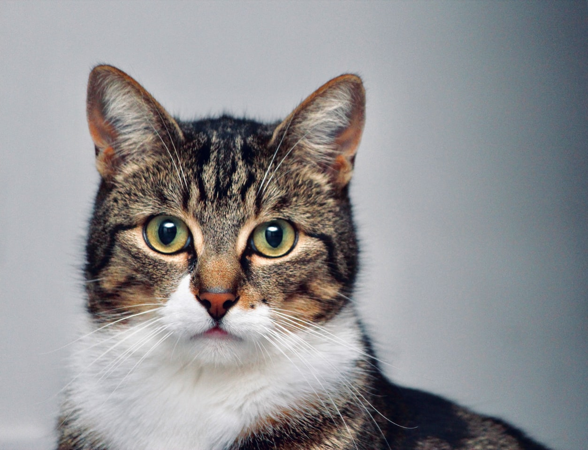 | 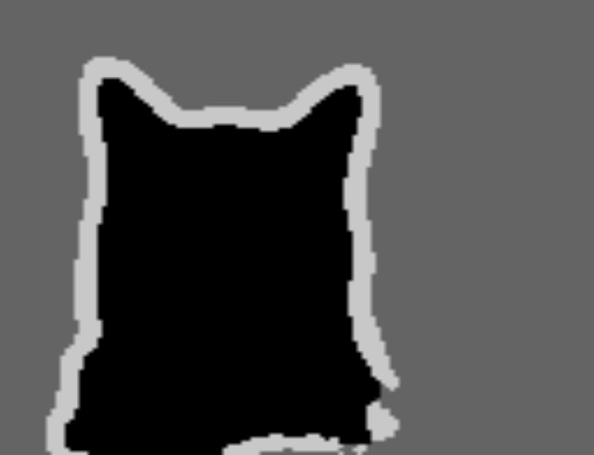
 | 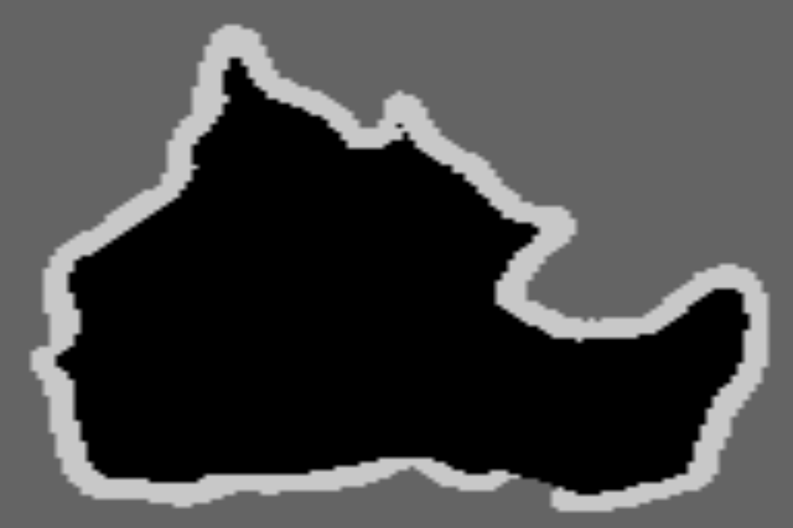
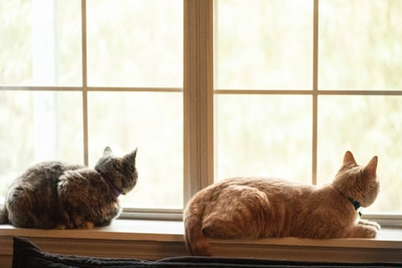 | 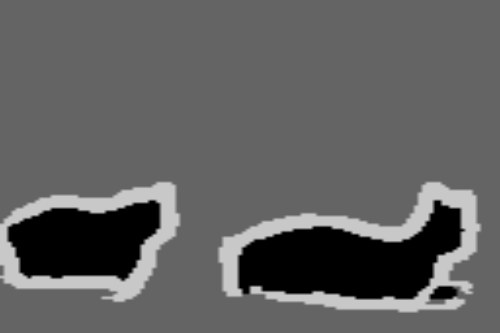
 | 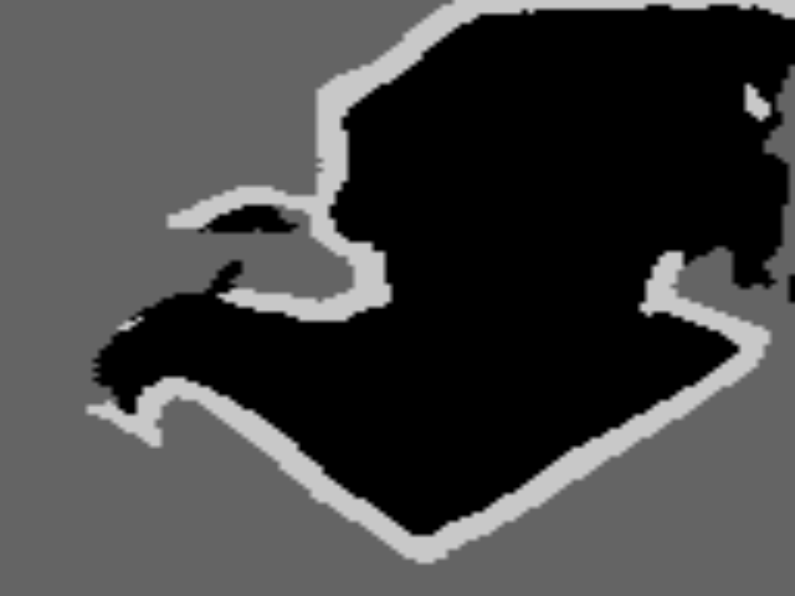
 | 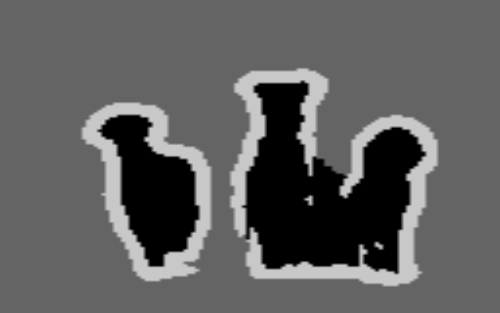
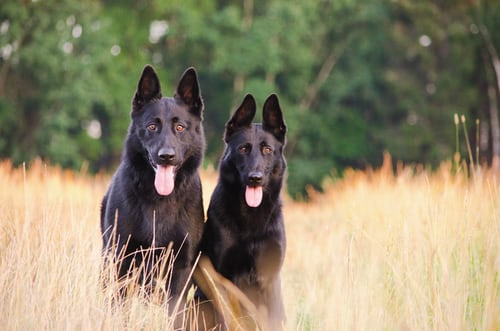 | 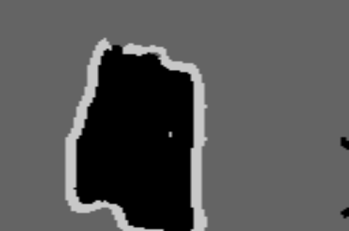


